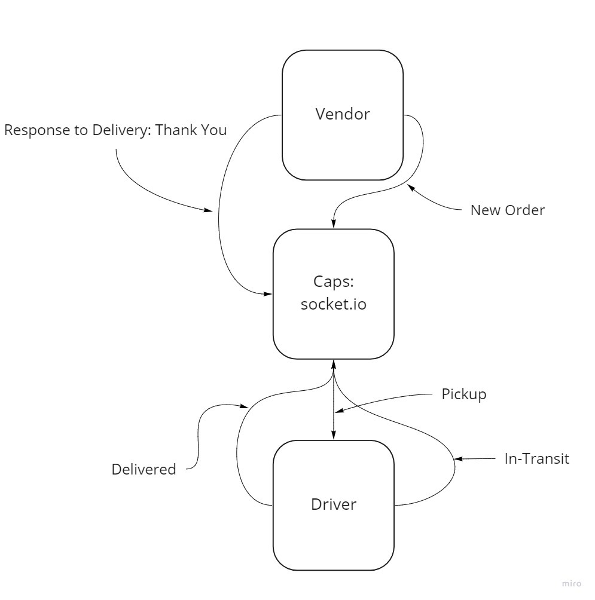

# caps-phase-2-vendor

Collaborated with: Davion on Lab

Worked alongside Jennor, Mark, Arthur

## Deployment Test

Author: TJ Simms

- Local Testing: Jest
## Setup
- npm i
- dependencies: socket.io socket.io-client

## Running the app
- Waits for socket connections from clients
- emits and fires events based on events emitted of on port 3000

## Tests
- Units tests
- Event handler functions

## UML

